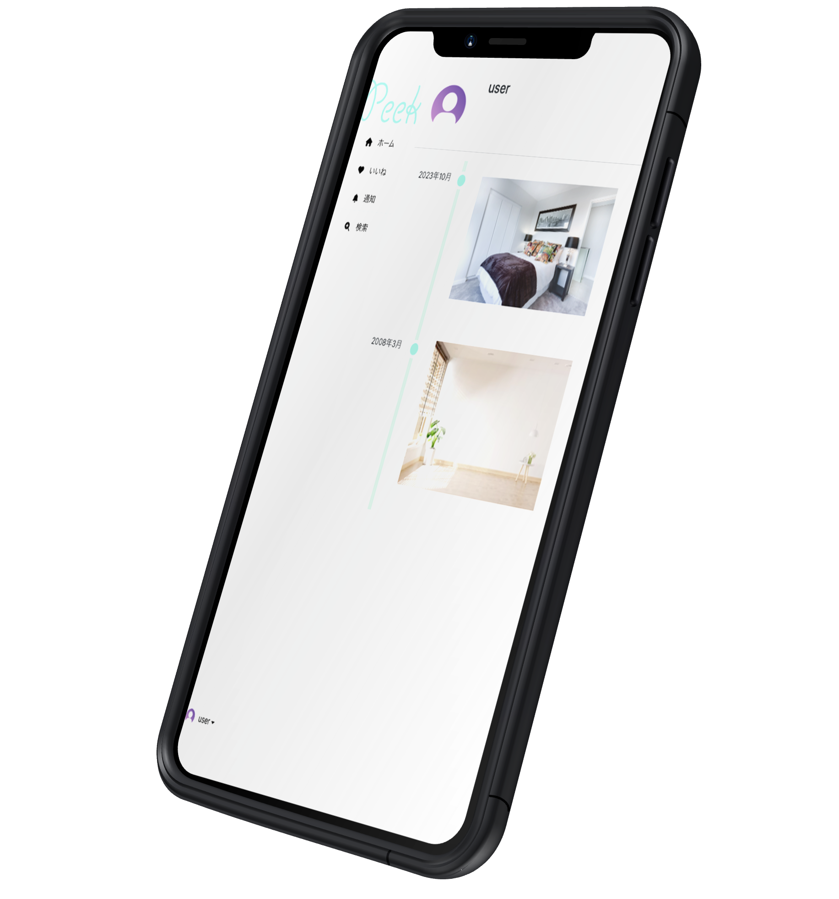

# Peek

## 製品概要

### 背景(製品開発のきっかけ、課題等）
大学生は学業が忙しく、家事に時間をかけられない問題がある。そして、その中でも部屋掃除は後回しにされやすい作業だと考えられる。この部屋掃除をできない問題を解決したいと考えた。
### 製品説明（具体的な製品の説明）

### 特長
#### 1. 特長1
友人同士で部屋の情報を共有し、リアクションし合うことができる
#### 2. 特長2
サーバー上で動くSNSを提供。誰でも自由にアクセスすることができます。

### 解決出来ること
* 友人同士で部屋の様子を共有し合うこと
* コメントを用いて部屋掃除のモチベーションアップに繋げることができる。
### 今後の展望
* AIによるスコア化の実装
* push通知により写真投稿を促す機能の実装
### 注力したこと（こだわり等）
* サーバーへのデプロイ
* (実装には至らなかったが)フロントエンドのデザイン
* (         〃        )レスポンシブデザイン
* (         〃        )AIでの機械学習

## 開発技術
### 活用した技術

#### フレームワーク・ライブラリ・モジュール
* Python
    * Django
* HTML
    * Bootstrap5.3
* CSS
* JavaScript

#### デバイス
* PC
* スマートフォン
* タブレット端末
など

#### サーバー
* Render

### 独自技術
#### ハッカソンで開発した独自機能・技術
* 友人同士で部屋を見せ合うアプリ「Peek」\
部屋の様子を共有を通した生活改善webアプリ
* 友人の部屋を覗ける機能 \
大学生の忙しさからくる部屋の掃除不足問題を解決する独自の機能
* 他人の目モチベーションになる仕組み \
部屋画像を公開することによって、友人が自分の部屋に来るときのように部屋を片付ける動機付けを実現
* general.html、general.cssによるフロントエンドでのサイドバーの固定
* build.shやrender.yamlによるサーバーサイドの開発、デプロイ
